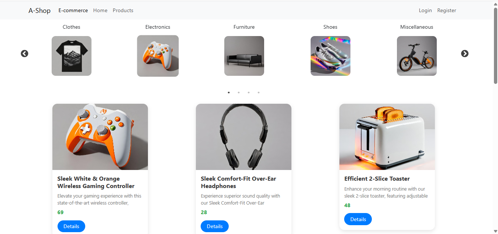
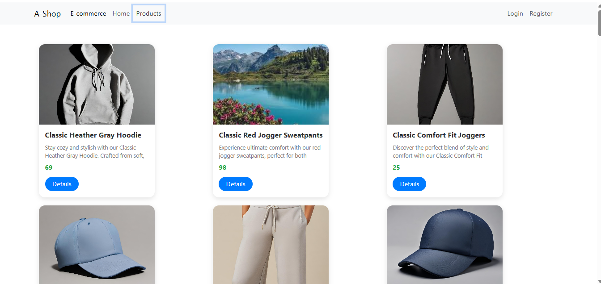
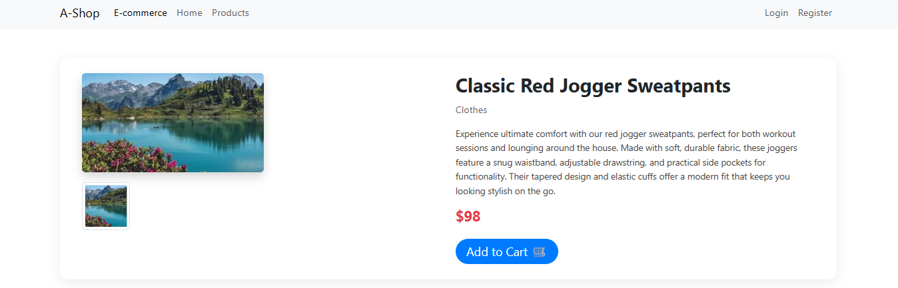
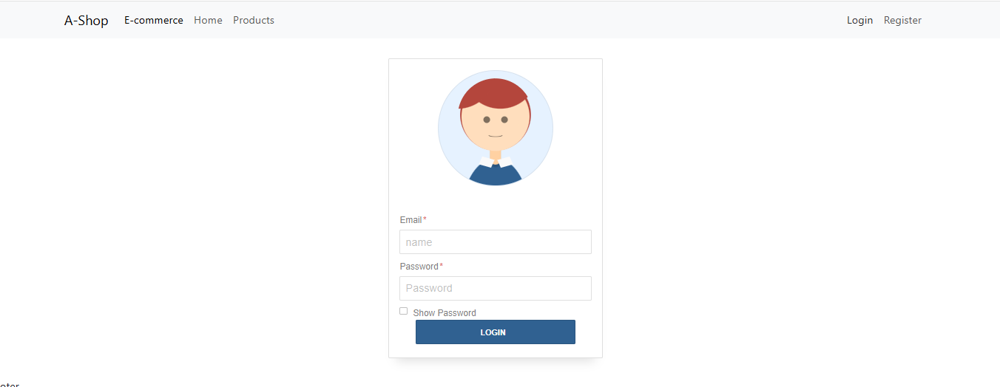

# 🛒 React E-commerce with JWT  

🌐 **Live Demo:** [View Project](https://amelchenni.github.io/react-ecommerce-jwt/)  

---

## 📖 Description  
This **React E-commerce with JWT** project is a beginner-to-intermediate online shopping app built with React.  
It allows users to **register/login using JWT authentication**, browse products, view details of each product, and explore product categories with filters.  
The project is designed as practice for **React state management (`useState`, `useContext`)**, **React Router**, and **API integration**.

---

## 🚀 Features  
- 📝 **User registration and login** with JWT token handling (authentication).  
- 🛍️ Browse a list of products.  
- 🗂️ **Product categories and filters** implemented.  
- 🎨 Responsive UI for desktop and mobile devices.  
- 💾 State management using React Hooks and Context API.  

> ℹ️ Note: The registration form design was adapted from a pre-made template for faster development and UI consistency.

---

## 🛠️ Technologies Used  
- **React (Hooks: useState, useEffect, useContext)** – Component logic & state handling  
- **React Router DOM** – Client-side routing  
- **Axios** – API requests  
- **JavaScript (ES6)** – Core functionality  
- **HTML5 & CSS3** – Structure and styling  
- **Bootstrap 5** – Responsive layout  
- **JWT (JSON Web Token)** – Authentication  

---

## 📷 Preview  
  
  
  
 
 

---

## 📌 Future Improvements  
- ➕ Add products to the **shopping cart**.  
- 🛒 View and manage **cart items**.  
- Improve registration/login forms with **custom styling**.  
- Persist cart data in **localStorage** or a backend database.  
- Add **payment integration**.  
- Improve UI with **animations, themes, and accessibility**.

---

## ▶️ Usage  
1. Clone this repository:  
   ```bash
   git clone https://github.com/AmelChenni/react-ecommerce-jwt.git
